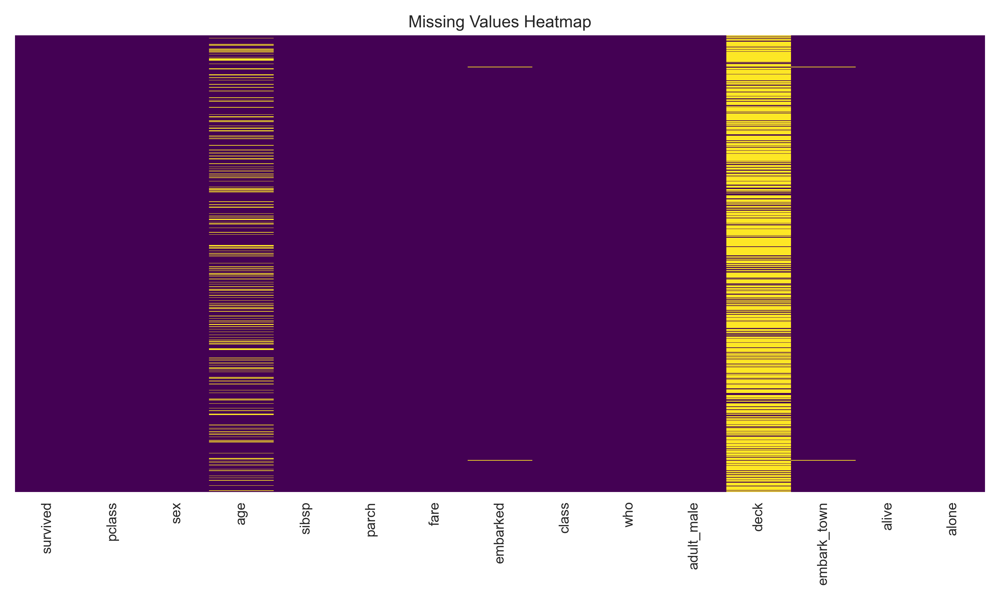
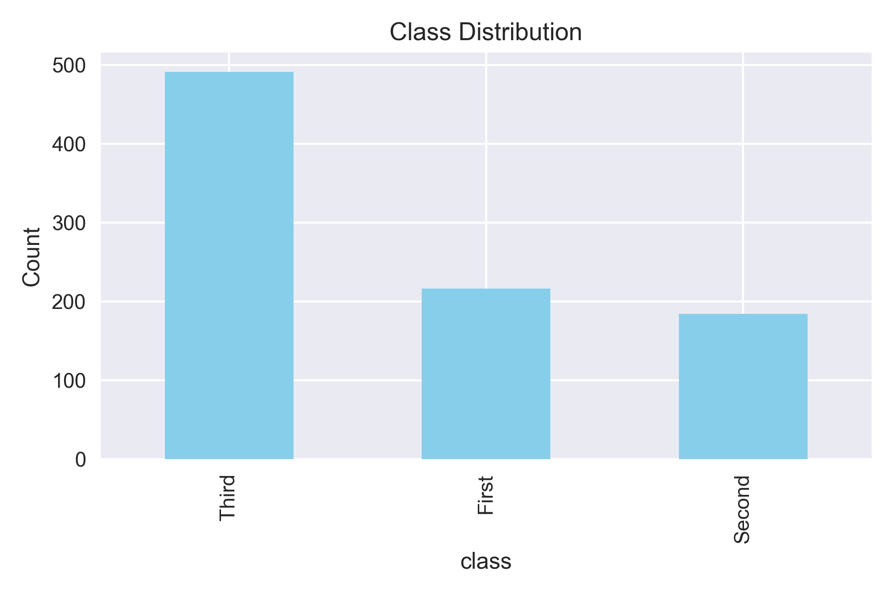
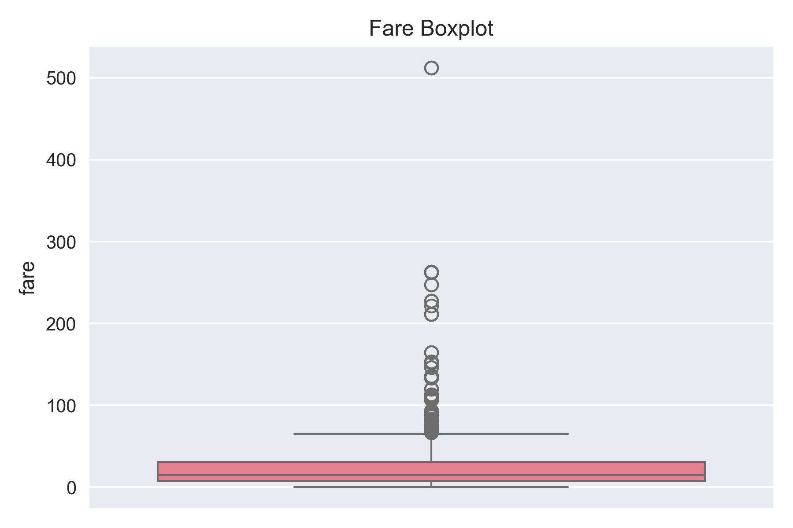
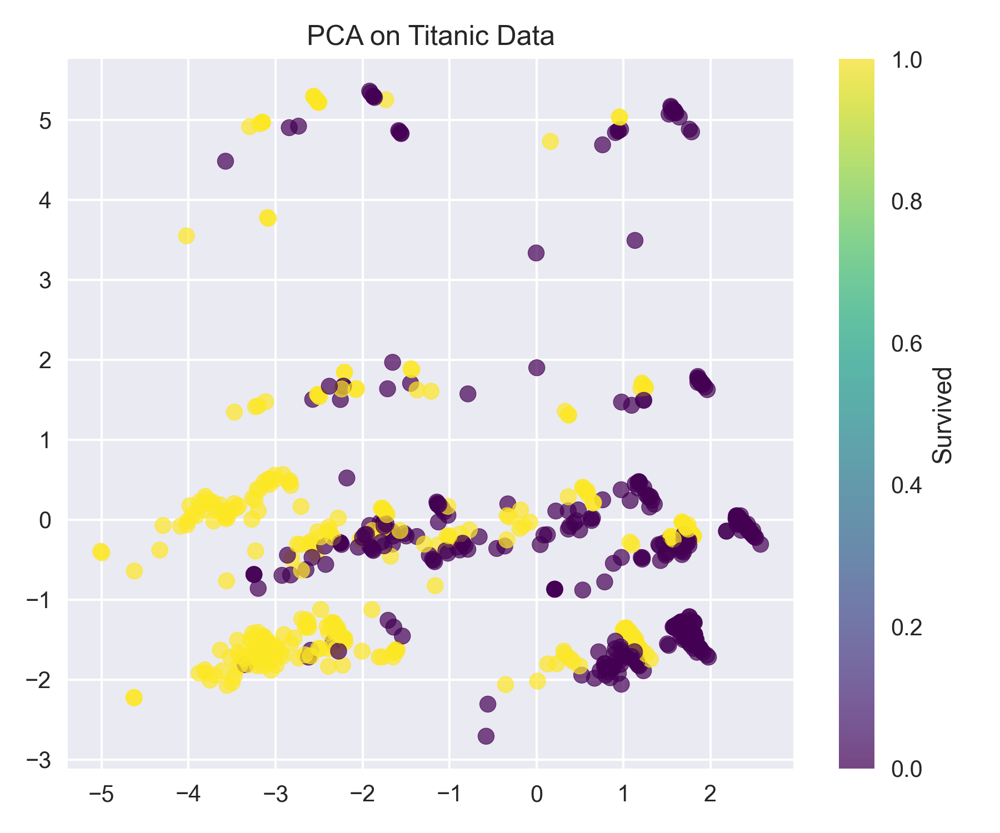
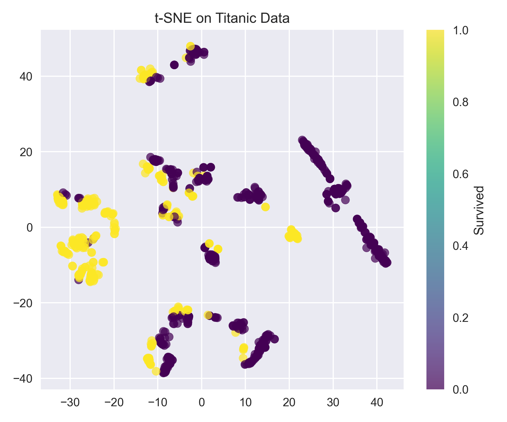
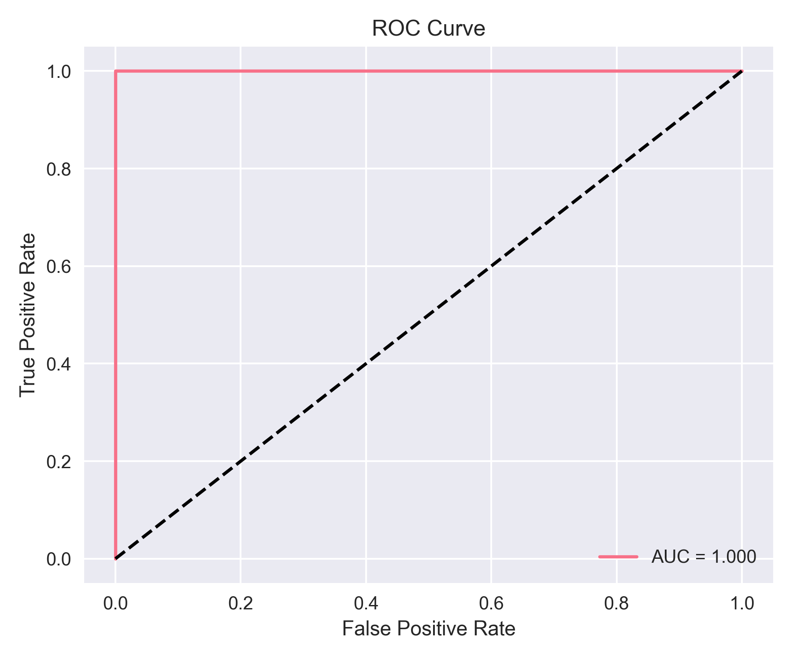

# Titanic Dataset Exploratory Data Analysis

An in-depth exploratory data analysis of the famous Titanic dataset, uncovering patterns and insights about passenger survival rates through comprehensive statistical analysis and machine learning techniques.

## 📊 Project Overview

This project performs a thorough exploratory data analysis on the Titanic dataset to understand the factors that influenced passenger survival during the 1912 disaster. Through data visualization, statistical analysis, and dimensionality reduction techniques, we explore relationships between various passenger characteristics and their likelihood of survival.

## 🎯 Objectives

- Analyze passenger demographics and their correlation with survival rates
- Identify missing data patterns and implement appropriate handling strategies
- Explore feature relationships through advanced visualization techniques
- Apply dimensionality reduction methods (PCA, t-SNE) for pattern discovery
- Build and evaluate predictive models for survival classification

## 📁 Project Structure

```
titanic-eda/
│
├── EDA_Titanic.ipynb          # Main analysis notebook
├── output/                    # Generated visualizations
│   ├── missing_values_heatmap.png
│   ├── class_distribution.png
│   ├── fare_boxplot.png
│   ├── pca_plot.png
│   ├── tsne_plot.png
│   └── roc_curve.png
└── README.md                  # Project documentation
```

## 🔍 Key Analyses

### Data Quality Assessment
- **Missing Values Analysis**: Comprehensive examination of missing data patterns across all features
- **Data Distribution**: Statistical summary and distribution analysis of numerical and categorical variables

### Exploratory Visualizations
- **Class Distribution**: Analysis of passenger class demographics and survival patterns
- **Fare Analysis**: Box plot examination of fare distributions across different passenger segments
- **Missing Data Heatmap**: Visual representation of missing value patterns

### Advanced Analytics
- **Principal Component Analysis (PCA)**: Dimensionality reduction to identify key variance components
- **t-SNE Visualization**: Non-linear dimensionality reduction for cluster pattern discovery
- **Predictive Modeling**: Machine learning model development with ROC curve evaluation

## 📈 Key Findings

### Survival Patterns
- Passenger class significantly influenced survival rates
- Gender and age were strong predictors of survival
- Fare amount correlated with survival likelihood

### Data Insights
- Strategic missing data patterns revealed socioeconomic factors
- Feature engineering opportunities identified through correlation analysis
- Dimensionality reduction revealed distinct passenger clusters

## 🛠️ Technologies Used

- **Python 3.x**
- **Pandas** - Data manipulation and analysis
- **NumPy** - Numerical computing
- **Matplotlib/Seaborn** - Data visualization
- **Scikit-learn** - Machine learning and dimensionality reduction
- **Scipy** - TO determine stats of certain features
- **Jupyter Notebook** - Interactive development environment

## 📊 Visualizations

| Visualization | Description |
|---------------|-------------|
|  | Heatmap showing missing data patterns across features |
|  | Distribution of passengers across different classes |
|  | Box plot analysis of fare distributions |
|  | Principal Component Analysis visualization |
|  | t-SNE dimensionality reduction plot |
|  | Model performance evaluation curve |

## 🚀 Getting Started

### Prerequisites
```bash
pip install pandas numpy matplotlib seaborn scikit-learn jupyter scipy
```

### Running the Analysis
1. Clone the repository:
   ```bash
   git clone https://github.com/AbirBanerjee1223/celebal-4-titanic_EDA.git
   cd celebal-4-titanic_EDA
   ```

2. Launch Jupyter Notebook:
   ```bash
   jupyter notebook EDA_Titanic.ipynb
   ```

3. Run all cells to reproduce the analysis and generate visualizations

## 📋 Analysis Workflow

1. **Data Loading & Initial Exploration**
   - Import dataset and examine basic structure
   - Generate summary statistics

2. **Data Cleaning & Preprocessing**
   - Handle missing values using appropriate strategies
   - Feature engineering and transformation

3. **Exploratory Data Analysis**
   - Univariate and bivariate analysis
   - Correlation analysis and feature relationships

4. **Advanced Visualization**
   - Dimensionality reduction techniques
   - Pattern discovery through unsupervised learning

5. **Predictive Modeling**
   - Model development and training
   - Performance evaluation and validation

## 🤝 Contributing

Contributions are welcome! Please feel free to submit a Pull Request. For major changes, please open an issue first to discuss what you would like to change.

## 📄 License

This project is licensed under the MIT License - see the [LICENSE](LICENSE) file for details.

## 🙏 Acknowledgments

- Kaggle for providing the Titanic dataset
- The data science community for inspiration and best practices
- Contributors and reviewers who helped improve this analysis

## 📧 Contact

Feel free to reach out if you have any questions or suggestions!

---

⭐ **Star this repository if you found it helpful!**
